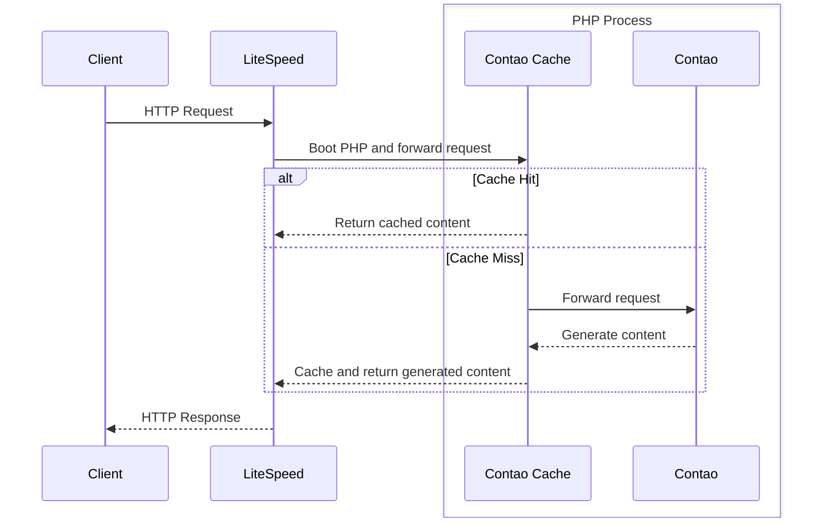
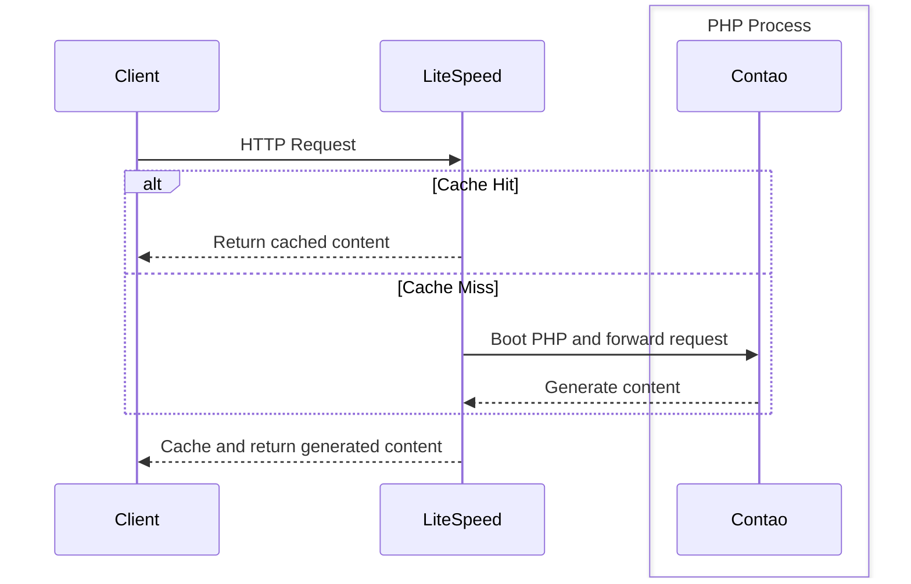

# Contao LiteSpeed Reverse Caching Proxy Integration

> [!CAUTION]
> Work in progress

This bundle integrates [LiteSpeed Cache](https://lscache.io) with your Contao setup and thus provides even faster 
HTTP caching than Contao already provides out of the box.

## Abstract

The [Contao Open Source CMS](https://www.contao.org) is already highly optimized for HTTP caching and fully adheres 
to the standards. Out of the box, it ships with a caching proxy written in PHP built on top of Symfony's `HttpCache`.
In other words: Contao can already cache and serve cached responses pretty fast without installing and 
configuring any caching proxy at all. More than just that, actually! Thanks to the integration of the 
[`FOSHttpCacheBundle`](https://github.com/FriendsOfSymfony/FOSHttpCacheBundle) it provides support for cache tagging 
and cache tag invalidation. For example, Contao automatically tags the generated HTTP responses with IDs of all 
sorts of things you placed on that page: content elements, articles, forms, news, page structure info etc. As soon 
as you edit any of the affected elements in the backend, Contao will automatically inform the caching proxy about 
which cache tags should be invalidated and thus, the respective cached responses are removed from the cache and your 
visitors will get your updated content on the next visit!

As already mentioned, all of this is built on top of Symfony's `HttpCache` (and a lot of other components) written 
in PHP. Now, PHP can be operated with an array of different so-called SAPIs (server APIs). The most popular amongst 
them probably being `php-fpm`. If you operate PHP using `php-fpm`, you need a webserver (Apache, Nginx, Caddy etc.) 
that converts the HTTP request to CGI then passes the data to `php-fpm` and back. So you have two processes involved 
which makes things slower. In case of LiteSpeed, though, it uses its own `litespeed` SAPI eliminating the need for a 
separate process. Serving the HTTP response and running PHP happens in the same process. There are other projects 
with similar approaches, such as `frankenphp`, `swoole` and others.

Long story short: LiteSpeed by nature should already be faster than your regular `php-fpm` setup. In fact, [it 
is a lot faster](https://www.litespeedtech.com/open-source/litespeed-sapi/php).

However, in order to serve a cached response in the standard Contao setup, it still needs to run through the entire 
logic of its `litespeed` SAPI to serve a PHP request. Creating the superglobals, loading OPcache symbols, etc.

Let's visualize this real quick (notice the `PHP Process` which is always triggered):



Enter [LiteSpeed Cache](https://lscache.io). LiteSpeed Cache provides all the features we need. We can configure it 
to ignore irrelevant query parameters or Cookies, make it only cache HTML responses, and it provides support for 
cache tagging and cache invalidation! 

So if we don't have a cache hit, it of course still has to spawn PHP and ask Contao to generate the response but if 
we have a cache hit, there's no need for this additional step, and it all happens within LiteSpeed itself (notice 
how the `PHP Process` is only triggered in case of a cache miss):



That's the entire reason why this bundle exists. 

🚀⚡ **More speed for cached responses!** ⚡🚀

## Configuration

To use this bundle, you need to configure both, the LiteSpeed webserver and Contao so they play well together.

### LiteSpeed configuration

These are all the steps necessary to configure LiteSpeed Cache. It all happens via editing your `.htaccess` in `public`:

* First of all, we need configure LiteSpeed to enable LiteSpeed Cache for public responses on the entire domain (`/`).
* Then, we want to make sure we ignore forced cache reloads on requests that send `Cache-Control: no-cache`.
* Then, we want to optimize the cache key so it ignores all the query parameters that are not relevant to our 
  application. Typically, these are marketing parameters like `utm*` etc.
* Then, we want to optimize it so it ignores all the cache if a relevant cookie is present. If you 
  configured a [`COOKIE_ALLOW_LIST`](https://docs.contao.org/manual/en/performance/http-caching/#cookie-allow-list) 
  in your environment variables for the PHP caching proxy of Contao, this is what you want to migrate.
* Finally, we want to ensure, it only caches HTML responses that contain `text/html` in the `Content-Type` header to 
  prevent it from caching files etc. which are already highly optimized in LiteSpeed anyway.

Here's an example of how your `.htaccess` could look like. Check the [LiteSpeed Cache](https://docs.litespeedtech.com/lscache/) docs
for more information:

```
<IfModule LiteSpeed>
    # Enable LiteSpeed Cache
    CacheEnable public /

    # Ignore requests (!) that try to force cache reloading sending a no-cache header
    CacheIgnoreCacheControl On

    # Remove irrelevant query parameters from the cache key. Use * as placeholder
    CacheKeyModify -qs:gclid,dclid,fbclid,zanpid,cx,ie,cof,siteurl,gclsrc,utm*

    RewriteEngine On

    # Bypass cache if any of these cookies are present on the request
    RewriteCond %{HTTP_COOKIE} PHPSESSID|csrf_https-contao_csrf_token|trusted_device|REMEMBERME [NC]
    RewriteRule .* - [E=Cache-Control:no-cache,E=t42_ls_bypass:1]

    # Skip cache if response is not HTML
    RewriteCond %{RESP_CONTENT_TYPE} !^text/html
    RewriteRule .* - [E=Cache-Control:no-cache,E=t42_ls_bypass:1]
</IfModule>
```


As you can see, we set two environment variables when we want to bypass the cache: `Cache-Control = no-cache` and 
`t42_ls_bypass = 1`. The first one is for LiteSpeed to bypass the cache completely (= it disables the module 
entirely) and the second one is to inform this bundle that the cache is completely disabled. In this case, it needs 
to remove the `X-LiteSpeed-Tags` header from the response because LiteSpeed does not do that if the module is 
disabled entirely.

###  Contao configuration

To make Contao work well with our LiteSpeed Cache, we need to do two things:

1. Disable the built-in cache proxy. Open your `.env.local` and add:

```dotenv
DISABLE_HTTP_CACHE=true
```

2. Adjust the Contao configuration so it uses `X-LiteSpeed-Tag` as the cache tag header and integrate cache tag 
   invalidation with the `LiteSpeedProxy` service of this bundle. Open your `config/config.yaml` and add:

```yaml
fos_http_cache:
    tags:
        enabled: true
        response_header: 'X-LiteSpeed-Tag'
    cache_manager:
        custom_proxy_client: Terminal42\ContaoLiteSpeedCache\LiteSpeedProxy
        
```

3. Adjust tag prefix and environment variable if needed (optional):

Cache tags are global for one `CacheRoot`. In LiteSpeed you can configure the `CacheRoot` only at server level, meaning
you cannot dynamically adjust it in your `.htaccess`. But sometimes you may not have access to this configuration because
you e.g. run on a shared hosting environment. This can be  problematic because if you run two Contao setups on the same
environment, invalidating certain tags in one setup may also invalidate the cache entries of the other setup in case you
happen to use the same tags which is very likely.
You can add a custom prefix to the tags then (but for data saving reasons, you may not use more than 3 characters):

```yaml
terminal42_contao_lite_speed_cache:
  tag_prefix: 'p1-' # project 1
```

Happy fast caching! 😎


### Miscellaneous info

* Make sure to add the `fos:httpcache:clear` command to your deployment script in case you are using automated 
  deployments. This will clear the LiteSpeed Cache thanks to the integration of this bundle.
* Performance: Feel free to report your own results. We were able to speed up cached requests by around **15 - 20%**, 
  depending on the concurrency and other factors of course.